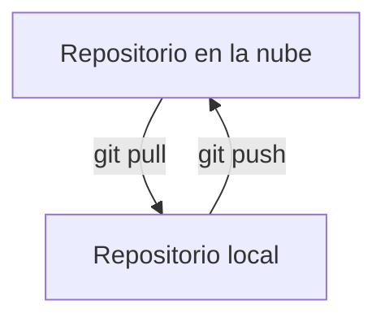

# Introducción a GitHub

Github es una plataforma de desarrollo colaborativo de software para alojar proyectos utilizando el sistema de control de versiones Git. El código se almacena de forma pública, aunque también se puede hacer de forma privada, creando una cuenta de pago o estudiantil.

Este servicio surge de la necesidad de poder compartir código entre programadores de cualquier parte del mundo. El sistema permite subir tu código a un repositorio, el cual podrás compartir con cualquier persona que desee colaborar contigo en tu proyecto. Además de permitir el `Control de Versiones` de tu código el cual te permite llevar un registro de los cambios que se han realizado sobre un archivo o conjunto de archivos a lo largo del tiempo, de modo que puedas recuperar versiones específicas más adelante. Para ello, se suele utilizar un sistema de control de versiones (VCS).

Dentro del marco de este curso utilizaremos GitHub para compartir el código de los ejercicios y proyectos que realicemos. Así como para compartir los ejercicios que cada uno de ustedes realice. 

## ¿Qué es un repositorio?

Un repositorio es un espacio donde se almacena el código de un proyecto. Puede contener carpetas y archivos, imágenes, videos, hojas de cálculo y conjuntos de datos, todo lo que necesite tu proyecto. Recomendamos incluir un archivo README o una descripción del proyecto en tu repositorio. GitHub hace que sea fácil agregar uno al crear tu repositorio.

## ¿Cómo crear un repositorio?

Existen multiples formas de crear un repositorio, en este caso utilizaremos la interfaz de web de GitHub para crear un repositorio. Para ello entraremos a la pagina de [GitHub](https://www.github.com) y nos loguearemos con nuestra cuenta. Una vez logueados nos dirigiremos a la esquina superior derecha y daremos click en el botón `+` y seleccionaremos la opción `New repository`. Aquí nos aparecerá una ventana donde podremos configurar nuestro repositorio, podremos darle un nombre, una descripción, si queremos que sea público o privado, si queremos agregar un archivo README, etc. Una vez configurado nuestro repositorio daremos click en el botón `Create repository` y listo, ya tenemos nuestro repositorio creado.

## ¿Cómo iniciar un repositorio en mi computadora?

Una vez creado nuestro repositorio en GitHub, podemos clonarlo en nuestra computadora para poder trabajar en él. Para ello abriremos la terminal de comandos y nos dirigiremos a la carpeta donde queremos clonar nuestro repositorio. Una vez en la carpeta ejecutaremos el siguiente comando:

```bash
git clone "url del repositorio"
```

Despues de que el proceso termine tendremos una copia de nuestro repositorio en nuestra computadora. y a partir de aquí podremos trabajar en nuestro proyecto.

### Agregar archivos a nuestro repositorio

El primer paso será agregar los archivos que queremos que estén en nuestro repositorio. Para ello ejecutaremos el siguiente comando:

```bash
git add .
```

Este comando agregará todos los archivos que se encuentren en la carpeta donde estamos trabajando. Después de agregar los archivos ejecutaremos el siguiente comando:

```bash
git commit -m "mensaje"
```

Un `Commit` es un registro de cambios en el repositorio. Cada `Commit` tiene un mensaje asociado que describe los cambios realizados. Los `Commit` son la base de datos de tu repositorio. Para que los cambios se vean reflejados en el repositorio de GitHub debemos ejecutar el siguiente comando:

```bash
git push
```

Una vez ejecutado este comando todos los cambios que hayamos realizado en nuestro repositorio local se verán reflejados en nuestro repositorio de GitHub en la nube.

### Actualizar nuestro repositorio local

Si en algún momento queremos actualizar nuestro repositorio local con los cambios que se hayan realizado en el repositorio de GitHub en la nube, debemos ejecutar el siguiente comando:

```bash
git pull
```

Este comando hará el proceso inverso al comando `git push`, es decir, actualizará nuestro repositorio local con los cambios que se hayan realizado en el repositorio de GitHub en la nube.



## Ramas

Una rama es una versión paralela de un repositorio. Se utilizan para desarrollar funcionalidades de forma aislada unas de otras. La rama principal de un repositorio es `master`. Las ramas nuevas se crean a partir de esta rama principal. Utilizamos ramas porque nos permiten desarrollar funcionalidades de forma aislada, sin que afecten al resto de ramas del repositorio. Una vez que la funcionalidad está desarrollada, se integra en la rama principal (master) mediante un proceso que se denomina `merge`.

### Crear una rama

Para crear una rama ejecutaremos el siguiente comando:

```bash
git branch "nombre de la rama"
```

Este comando crear una nueva rama con el nombre que le hayamos dado. Para cambiar a la rama que acabamos de crear ejecutaremos el siguiente comando:

```bash
git checkout "nombre de la rama"
```

Ahora todos los cambios que realicemos se verán reflejados en la rama que acabamos de crear y no afectaremos a la rama principal, esto es muy util cuando queremos desarrollar nuevo código sin afectar el código que ya tenemos funcionando ya que si algo sale mal podemos regresar a la rama principal y seguir trabajando en ella.

### Eliminar una rama

Para eliminar una rama ejecutaremos el siguiente comando:

```bash
git branch -d "nombre de la rama"
```

Este comando eliminará la rama que le indiquemos. Para eliminar una rama esta no debe estar activa, es decir, debemos estar en otra rama para poder eliminarla.

### Fusionar ramas

Cuando el código desarrollado está listo para ser integrado en la rama principal (master), se debe fusionar la rama con la rama principal. Para ello nos dirigiremos a la rama principal y ejecutaremos el siguiente comando:

```bash
git merge "nombre de la rama"
```

Esto fusionará la rama que le indiquemos con la rama principal.
