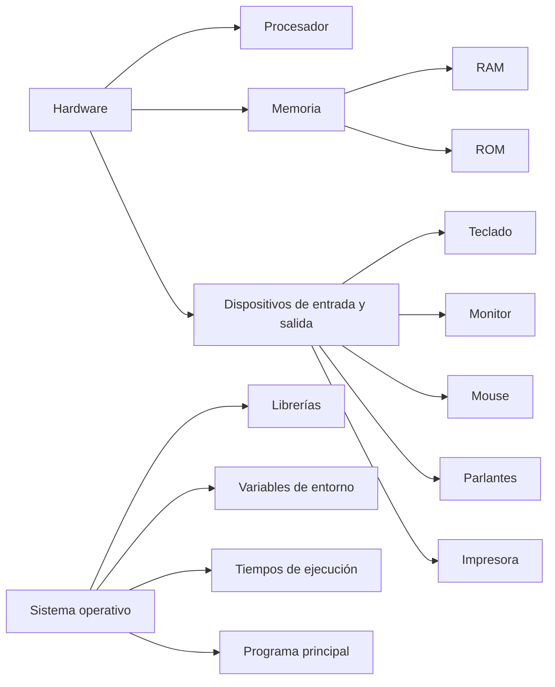

# El entorno de ejecución

El entorno de ejecución es el conjunto de elementos que permiten que un programa se ejecute. En el caso de C++ el entorno de ejecución está compuesto por:

- El hardware: el procesador, la memoria, los dispositivos de entrada y salida, etc.
- El sistema operativo: el software que controla el hardware y permite que los programas se ejecuten.
- Librerías: son programas que se pueden utilizar desde otros programas. En C++ las librerías se agrupan en lo que se conoce como la biblioteca estándar de C++.
- Variables de entorno: son variables que se definen en el sistema operativo y que pueden ser utilizadas por los programas. Por ejemplo, la variable de entorno PATH contiene la lista de directorios en los que el sistema operativo buscará los programas que se ejecuten desde la línea de comandos.
- Tiempos de ejecución: Se refiere al período durante el cual el programa se está ejecutando. Durante este tiempo, el programa interactúa con el entorno, realiza cálculos y ejecuta sus instrucciones.
- El programa principal: es el programa que se ejecuta.
- Recursos: son elementos que se pueden utilizar desde el programa principal. Por ejemplo, un archivo de texto, un archivo de audio, etc.

Entonces el entorno de desarrollo va a ser el conjunto de todas las herramientas necesarias para poder trabajar nuestros progrmas y que estos funcionen de manera optima.

Si alguno de estos elementos llegase a faltar no podríamos trabajar

## Ejericio 1

Contestar las siguientes preguntas:

1. ¿Qué es un compilador?
2. ¿Qué es un enlazador?
3. ¿Qué es una librería?
4. ¿Qué es un IDE?
5. ¿Qué es un dispositivo de entrada?
6. ¿Qué es un dispositivo de salida?
