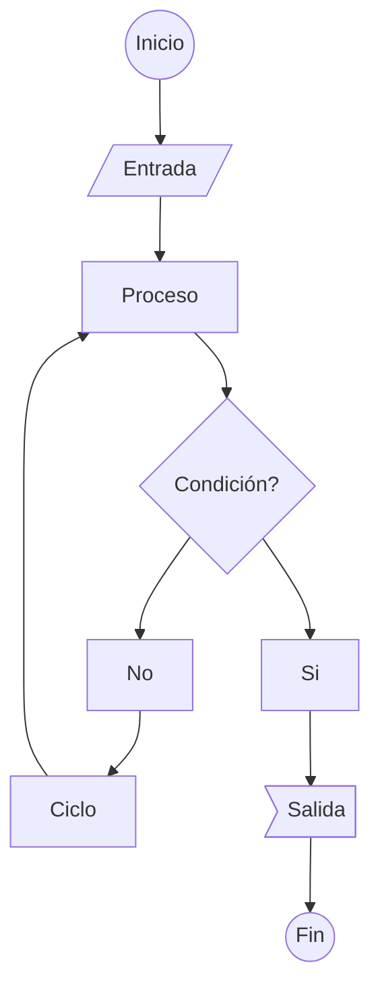
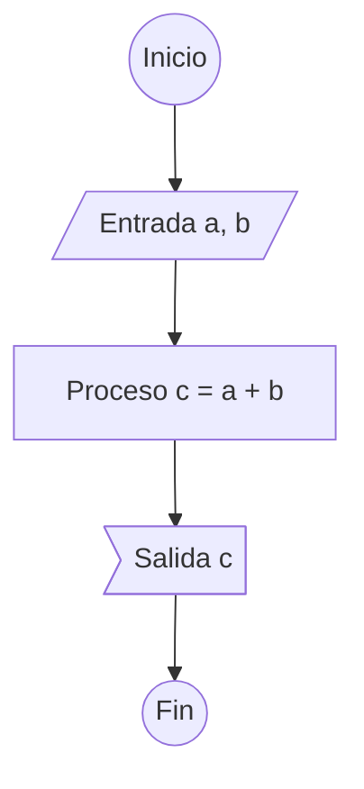

# Programación 1

## Introdución a la programación

### ¿Qué es un programa?

Un programa es una secuencia de instrucciones que se ejecutan en una computadora para realizar una tarea específica. Estas instrucciones se escriben en un lenguaje de programación, el cual es un lenguaje artificial que se utiliza para comunicar instrucciones a una computadora.

### ¿Qué es programar?

Programar es la acción de escribir un programa. Es decir, es la acción de escribir una secuencia de instrucciones en un lenguaje de programación para que una computadora realice una tarea específica. Se puede programar en diferentes lenguajes de programación, como C, C++, Java, Python, etc.

### ¿Qué es un lenguaje de programación?

Un lenguaje de programación es un lenguaje artificial que se utiliza para comunicar instrucciones a una computadora. Existen diferentes lenguajes de programación, como C, C++, Java, Python, etc. Cada lenguaje de programación tiene sus propias reglas de sintaxis y semántica así como sus fortalezas y debilidades.

### ¿Qué es un compilador?

Un compilador es un programa que traduce un programa escrito en un lenguaje de programación a un lenguaje de máquina. El lenguaje de máquina es un lenguaje que entiende la computadora y que está compuesto por una secuencia de instrucciones binarias. El proceso de traducción de un programa escrito en un lenguaje de programación a un lenguaje de máquina se conoce como compilación.

### ¿Qué es un lenguaje de máquina?

Un lenguaje de máquina es un lenguaje que entiende la computadora y que está compuesto por una secuencia de instrucciones binarias. Cada computadora tiene su propio lenguaje de máquina, por lo que un programa escrito en un lenguaje de máquina no puede ser ejecutado en una computadora diferente a aquella para la cual fue escrito.

### ¿A qué se refiere el nivel de un lengauje de programación?

Los lenguajes de programación se clasifican en diferentes niveles de acuerdo a su cercanía con el lenguaje de máquina. Los lenguajes de programación de bajo nivel son aquellos que están más cercanos al lenguaje de máquina, mientras que los lenguajes de programación de alto nivel son aquellos que están más acercados al lenguaje natural. Los lenguajes de programación de bajo nivel son más difíciles de aprender y de utilizar, pero son más eficientes que los lenguajes de programación de alto nivel. Los lenguajes de programación de alto nivel son más fáciles de aprender y de utilizar, pero son menos eficientes que los lenguajes de programación de bajo nivel.

Ejempos de lenguajes de programación de bajo nivel son el lenguaje ensamblador, lenguajes de medio nivel son C y C++, y ejemplos de lenguajes de programación de alto nivel son Java y Python.

### ¿Qué es un diagrama de flujo?

Un diagrama de flujo es una representación gráfica de un algoritmo. Un algoritmo es una secuencia de pasos que se siguen para resolver un problema. Un diagrama de flujo está compuesto por símbolos que representan diferentes tipos de instrucciones, como instrucciones de entrada, instrucciones de salida, instrucciones de procesamiento, instrucciones de decisión, instrucciones de ciclo, etc.



### ¿Qué es un algoritmo?

Un algoritmo (Del lat. tardío algorismus, y este del matemático persa _**Al-Khwarizmi**_)


[^1]

Es un conjunto ordenado y finito de operaciones que permite hallar la solución de un problema. También puede definirse como la secuencia de instrucciones que se utilizan para resolver un problema. ___Un algoritmo es una secuencia de pasos que se siguen para resolver un problema.___ Un algoritmo puede ser escrito en lenguaje natural, en un lenguaje de programación o en un diagrama de flujo.

Un ejemplo de algoritmo escrito en lenguaje natural es el siguiente:

1. Leer el primer número
2. Leer el segundo número
3. Sumar los dos números
4. Imprimir el resultado
5. Fin

Un ejemplo de algoritmo escrito en un lenguaje de programación es el siguiente:

```c

#include <stdio.h>

int main() {
    int a, b, c;
    scanf("%d", &a);
    scanf("%d", &b);
    c = a + b;
    printf("%d", c);
    return 0;
}

```

Un ejemplo de algoritmo escrito en un diagrama de flujo es el siguiente:



### ¿Qué es C?

C es un lenguaje de programación de propósito general que fue desarrollado por Dennis Ritchie en los laboratorios Bell en 1972. C es un lenguaje de programación de medio nivel, ya que combina elementos de lenguajes de programación de bajo nivel y de alto nivel. C es un lenguaje de programación de bajo nivel porque permite acceder directamente a la memoria y a los registros de la computadora, y es un lenguaje de programación de alto nivel porque permite utilizar estructuras de datos complejas y funciones.

C es un lenguaje de programación muy popular y es utilizado para desarrollar aplicaciones de escritorio, aplicaciones web, aplicaciones móviles, sistemas operativos, etc. C es un lenguaje de programación muy eficiente, ya que permite escribir programas que utilizan pocos recursos de la computadora, como memoria y tiempo de ejecución.

### ¿Qué es C++?

C++ es un lenguaje de programación de propósito general que fue desarrollado por Bjarne Stroustrup en 1983 basado en el lenguaje de programación C. C++ es un lenguaje de programación orientado a objetos, ya que permite definir clases y objetos. C++ es un lenguaje de programación de medio nivel, ya que combina elementos de lenguajes de programación de bajo nivel y de alto nivel. Permite la creación de complejas estructuras de datos y funciones, y permite acceder directamente a la memoria y a los registros de la computadora.

<mark>Para este curso utilizaremos el lenguaje de programación C++. 

[^1]: Imagen obtenida de: [www.biografiasyvidas.com](https://www.biografiasyvidas.com/biografia/k/khwarizmi.htm).
