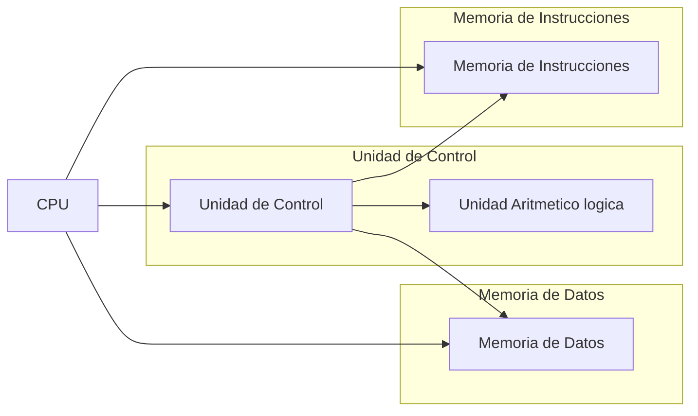
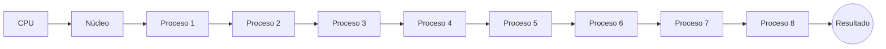
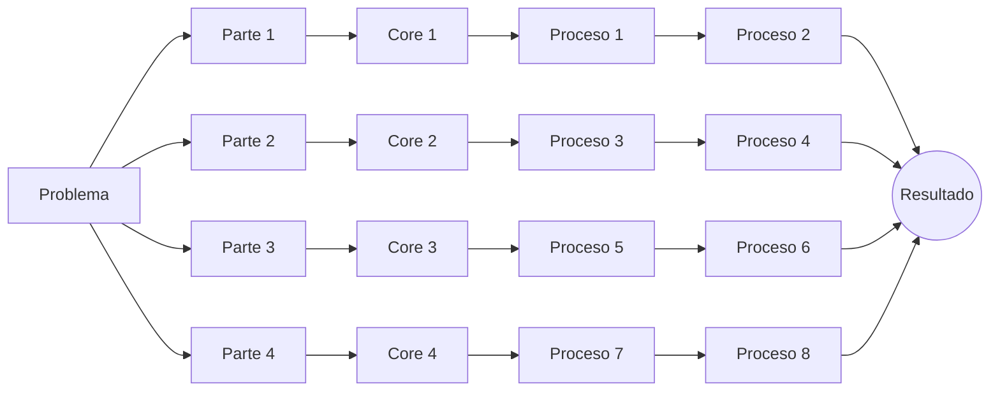
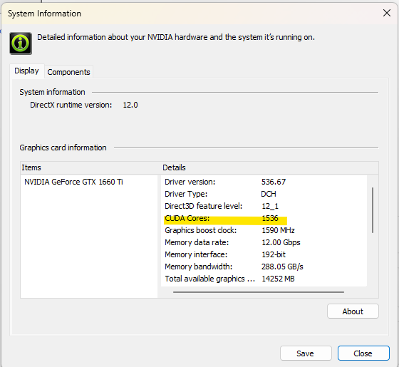

# Introducción a la Programación Paralela con CUDA

## Introducción

La programación es el acto de escribir código fuente para crear un programa para un computador. Cómo sabemos los computadores son máquinas que ejecutan instrucciones de forma secuencial, es decir, una instrucción a la vez. Por lo tanto, la programación secuencial es la forma natural de programar para un computador. Sin embargo, los computadores modernos tienen múltiples núcleos de procesamiento y pueden ejecutar múltiples instrucciones al mismo tiempo. La programación paralela es la forma de programar para aprovechar estos múltiples núcleos de procesamiento y ejecutar múltiples instrucciones al mismo tiempo.

Cuando queremos empezar a hablar de la programación tenemos que tener en claro conceptos clave, siendo el primero de ellos el de algoritmo. Un algoritmo es un conjunto de instrucciones que resuelven un problema. Por ejemplo, el algoritmo para sumar dos números es el siguiente:

1. Leer el primer número
2. Leer el segundo número
3. Sumar los dos números
4. Imprimir el resultado
5. Fin

Esto es un algoritmo, pero no es un programa. Un programa es la implementación de un algoritmo en un lenguaje de programación. Por ejemplo, el algoritmo anterior implementado en C es el siguiente:

```c
#include <stdio.h>

int main() {
    int a, b, c;
    scanf("%d", &a);
    scanf("%d", &b);
    c = a + b;
    printf("%d\n", c);
    return 0;
}
```

Una vez que esto queda claro, podemos explicar porque siempre la programación se ha visto de manera secuencial. Esto viene dado por un concepto conocido como arquitectura de Von Neumann. Esta arquitectura es la que tienen todos los computadores modernos y se basa en la idea de que el programa y los datos están en la misma memoria. Por lo tanto, el programa se ejecuta de manera secuencial, leyendo instrucción por instrucción y ejecutándolas una a la vez. Esto se puede ver en la siguiente figura:


Tambien existe la arquitectura Harvard, en la cual el programa y los datos están en memorias separadas. Esto permite que el programa se ejecute de manera paralela, leyendo y ejecutando múltiples instrucciones al mismo tiempo. Esto se puede ver en la siguiente figura:



La parte más importante de la computación de alto rendimiento es la Unidad de Procesamiento Central, o CPU. Esta es la parte del computador que ejecuta las instrucciones. La CPU tiene una serie de registros, que son pequeñas memorias que se encuentran dentro de la CPU. Estos registros son muy rápidos, pero también son muy pocos. Por lo tanto, la CPU tiene una memoria externa, que es la memoria RAM. Esta memoria es más lenta que los registros, pero tiene mucha más capacidad. Por lo tanto, la CPU tiene que leer los datos de la memoria RAM y guardarlos en los registros para poder operar con ellos. Además de esto el procesador cuenta con las Unidades Aritmético Lógicas, o ALU. Estas son las que realizan las operaciones aritméticas y lógicas. La CPU también cuenta con la Unidad de Control, que es la que se encarga de leer las instrucciones y decirle a la ALU que operación tiene que realizar. Por último, la CPU cuenta con la Unidad de Punto Flotante, o FPU. Esta es la que se encarga de realizar las operaciones aritméticas con números de punto flotante.

Los procesadores actuales dada la arquitectura con la que están construidos pueden contar con múltiples núcleos de procesamiento. Esto quiere decir que pueden ejecutar múltiples instrucciones al mismo tiempo. Esto se puede ver en la siguiente figura:



Ahora, existen otros paradigmas de programación que permiten aprovechar estos múltiples núcleos de procesamiento. El que utilizaremos en este curso es la programación paralela. Esta es la que se encarga de dividir un problema en múltiples partes y resolver cada una de estas partes en un núcleo de procesamiento diferente. Esto se puede ver en la siguiente figura:



Entonces como pueden ver, la programación paralela es la que se encarga de dividir un problema en múltiples partes y resolver cada una de estas partes en un núcleo de procesamiento diferente para luego unir los resultados y obtener el resultado final, esto es extremadamente util cuando se tienen problemas que se pueden dividir en partes independientes y además de ello contamos con un dispositivo que tiene múltiples núcleos de procesamiento como por ejemplo mí GPU *(NVIDIA :tm: 1660TI)*.




## Programación Paralela

Entonces la programación paralela es la que se encarga de dividir un problema en múltiples partes y resolver cada una de estas partes en un núcleo de procesamiento diferente para luego unir los resultados y obtener el resultado final. Ahora, existen dos formas de programar de manera paralela, la primera es la programación paralela a nivel de hilos y la segunda es la programación paralela a nivel de procesos. La programación paralela a nivel de hilos es la que se encarga de dividir un problema en múltiples partes y resolver cada una de estas partes en un hilo de ejecución diferente. La programación paralela a nivel de procesos es la que se encarga de dividir un problema en múltiples partes y resolver cada una de estas partes en un proceso diferente. La diferencia entre hilos y procesos es que los hilos comparten la memoria, mientras que los procesos no; Esto significa que los resultados de los hilos se pueden compartir entre ellos, mientras que los resultados de los procesos no se pueden compartir entre ellos y se podrán acceder a ellos una vez que el proceso termine.

## Programación Paralela con CUDA

Para trabajar de forma general con programación paralela se utilizan las GPU's debido a su gran cantidad de núcleos de procesamiento. Para trabajar con GPU's de NVIDIA :tm: se utiliza CUDA, que es una plataforma de programación paralela desarrollada por NVIDIA. CUDA es una plataforma de programación paralela que permite programar en C, C++ de forma bastante simple. Para poder programar en CUDA se necesita una GPU de NVIDIA :tm: y el SDK de CUDA. El SDK de CUDA es un conjunto de librerías que permiten programar en CUDA. Una vez que los requisitos ya están cumplidos lo unico que se necesita es tener un IDE para poder programar en CUDA. En este curso utilizaremos Visual Studio Code, pero se puede utilizar cualquier IDE que soporte C y C++ como por ejempli CLion de JetBrains :tm:.

## Ejericios

1. ¿Escribir un algoritmo para multiplicar dos matrices de 3x3?
2. ¿Escribir un algoritmo para multiplicar dos matrices de 3x3 de forma paralela?
