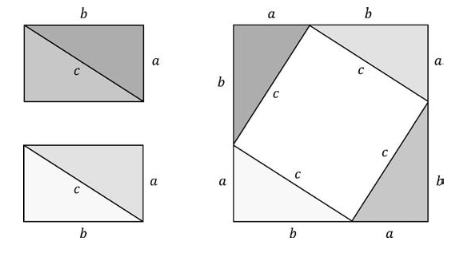
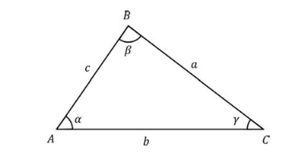

# Matemáticas para la simulación física en videojuegos

## Introducción

La simulación física en videojuegos utiliza las matemáticas como herramienta. Durante este curso lo más utilizado será la geometría y el algebra lineal de forma introductoria, vectores, trigonometría y los teoremas e identidades pitaogóricas, la ley de los cosenos y la orientación.

Después de eso, hablaremos de la reflexión principalmente con la colición de esferas y planos, y la colisión de esferas con esferas. También hablaremos de la detección de colisiones, y de la resolución de colisiones. Por lo que para ello necesitaran entender el concepto de `respuesta de colisión`.

## ¿Qué es un vector?

Un vector es una lista de escalares, normalmente escrita entre corchetes cuadrados como estos [0,1]. La dimensión de un vector representa el número de elementos que contiene. Por ejemplo, un vector de 2 dimensiones es un vector que contiene 2 elementos, y un vector de 3 dimensiones es un vector que contiene 3 elementos. *Para este curso nos centraremos en vectores de 2 dimensiones*.

Los vectores se utilizan para representar posiciones, velocidades, aceleraciones, fuerzas, etc.

Para trabajar con la introducción al algebra lineal utilzaremos la libreria de [d3dx9.h](https://www.microsoft.com/en-US/download/details.aspx?id=6812) que es una libreria de DirectX que nos permite trabajar con vectores y matrices.

Con los vectores podemos realizar una serie de operaciones, como son la suma, la resta, la multiplicación por un escalar, el producto escalar y el producto vectorial.

### Suma de vectores

La suma de vectores se realiza sumando cada uno de los elementos de los vectores. Por ejemplo, si tenemos dos vectores de 2 dimensiones, la suma de estos vectores sería:

$$
\begin{bmatrix} 1 \\ 2 \end{bmatrix} + \begin{bmatrix} 3 \\ 4 \end{bmatrix} = \begin{bmatrix} 1 + 3 \\ 2 + 4 \end{bmatrix} = \begin{bmatrix} 4 \\ 6 \end{bmatrix}
$$

$$
\overrightarrow{u} + \overrightarrow{v} = [u_x + v_x, u_y + v_y]
$$

### Resta de vectores

La resta de vectores se realiza restando cada uno de los elementos de los vectores. Por ejemplo, si tenemos dos vectores de 2 dimensiones, la resta de estos vectores sería:

$$
\begin{bmatrix} 1 \\ 2 \end{bmatrix} - \begin{bmatrix} 3 \\ 4 \end{bmatrix} = \begin{bmatrix} 1 - 3 \\ 2 - 4 \end{bmatrix} = \begin{bmatrix} -2 \\ -2 \end{bmatrix}
$$

$$
\overrightarrow{u} - \overrightarrow{v} = [u_x - v_x, u_y - v_y]
$$

### Multiplicación por un escalar

La multiplicación de un vector por un escalar se realiza multiplicando cada uno de los elementos del vector por el escalar. Por ejemplo, si tenemos un vector de 2 dimensiones y un escalar, la multiplicación de este vector por el escalar sería:

$$
\begin{bmatrix} 1 \\ 2 \end{bmatrix} * 2 = \begin{bmatrix} 1 * 2 \\ 2 * 2 \end{bmatrix} = \begin{bmatrix} 2 \\ 4 \end{bmatrix}
$$

$$
\overrightarrow{u} * s = [u_x * s, u_y * s]
$$

### Producto escalar

El producto escalar de dos vectores se realiza multiplicando cada uno de los elementos de los vectores y sumando los resultados. Por ejemplo, si tenemos dos vectores de 2 dimensiones, el producto escalar de estos vectores sería:

$$
\begin{bmatrix} 1 \\ 2 \end{bmatrix} * \begin{bmatrix} 3 \\ 4 \end{bmatrix} = \begin{bmatrix} 1 * 3 \\ 2 * 4 \end{bmatrix} = \begin{bmatrix} 3 \\ 8 \end{bmatrix} = 3 + 8 = 11
$$

$$
\overrightarrow{u} * \overrightarrow{v} = u_x * v_x + u_y * v_y
$$

### Producto vectorial

El producto vectorial de dos vectores se realiza multiplicando cada uno de los elementos de los vectores y restando los resultados. Por ejemplo, si tenemos dos vectores de 2 dimensiones, el producto vectorial de estos vectores sería:

$$
\begin{bmatrix} 1 \\ 2 \end{bmatrix} * \begin{bmatrix} 3 \\ 4 \end{bmatrix} = \begin{bmatrix} 1 * 3 \\ 2 * 4 \end{bmatrix} = \begin{bmatrix} 3 \\ 8 \end{bmatrix} = 3 - 8 = -5
$$

$$
\overrightarrow{u} * \overrightarrow{v} = u_x * v_y - u_y * v_x
$$

## Trigonometría

La trigonometría es una rama de las matemáticas que estudia las relaciones entre los lados y los ángulos de los triángulos. La trigonometría se utiliza para calcular la longitud de los lados de un triángulo, los ángulos de un triángulo, la distancia entre dos puntos, etc.

$$
\sin(\theta) = \frac{opuesto}{hipotenusa}
$$

$$
\cos(\theta) = \frac{adyacente}{hipotenusa}
$$

$$
\tan(\theta) = \frac{opuesto}{adyacente}
$$

Recuerden que también existen las funciones trigonométricas inversas, que son la inversa de las funciones trigonométricas. Por ejemplo, la función inversa de la función seno es la función arcoseno, la función inversa de la función coseno es la función arcocoseno, y la función inversa de la función tangente es la función arcotangente.

$$
\theta = \sin^{-1}(\frac{opuesto}{hipotenusa})
$$

$$
\theta = \cos^{-1}(\frac{adyacente}{hipotenusa})
$$

$$
\theta = \tan^{-1}(\frac{opuesto}{adyacente})
$$

[^1]

## Teorema de Pitágoras

El teorema de Pitágoras es uno de los teoremas más importantes y más antiguos de las matemáticas. El teorema de Pitágoras establece que en un triángulo rectángulo, el cuadrado de la hipotenusa es igual a la suma de los cuadrados de los catetos.

$a^2 + b^2 = c^2$

Esto se puede utilizar para calcular la longitud de un lado de un triángulo rectángulo si conocemos la longitud de los otros dos lados.

[^2]

La longitud de la hipotenusa es la longitud del lado más largo de un triángulo rectángulo. La longitud de los otros dos lados se denominan catetos.

$c=\sqrt{a^2+b^2}$

Esto toma importancia porque muchas veces necesitaremos calcular la magnitud de un vector, y para ello utilizaremos el teorema de Pitágoras.

$||\overrightarrow{v}|| = \sqrt{v_x^2 + v_y^2}$

Si multiplicamos un vector por un escalar, la magnitud del vector se multiplica por el valor absoluto del escalar.

$||\overrightarrow{v} * s|| \sqrt{(v_x * s)^2 + (v_y * s)^2} = \sqrt{v_x^2 * s^2 + v_y^2 * s^2} = \sqrt{s^2 * (v_x^2 + v_y^2)} = s * \sqrt{v_x^2 + v_y^2} = s * ||\overrightarrow{v}||$

Recuerden que los || representan la magnitud de un vector la cual tambien se define como un valor absoluto. Un valor absoluto es un número sin signo, por lo que si tenemos un número negativo, el valor absoluto de ese número será el mismo número pero sin el signo negativo. Por ejemplo, el valor absoluto de -5 es 5.

Otra cosa derivada de el teorema de Pitágoras es la identidad pitagórica $ \sin^2(\theta) + \cos^2(\theta) = 1 $.
La cual nos permite calcular el seno o el coseno de un ángulo si conocemos el otro de la siguiente forma:

$\sin(\theta) = \sqrt{1 - \cos^2(\theta)}$

$\cos(\theta) = \sqrt{1 - \sin^2(\theta)}$

## Ley de los cosenos

La ley de los cosenos es una extensión del teorema de Pitágoras. La ley de los cosenos establece que en un triángulo cualquiera, el cuadrado de un lado es igual a la suma de los cuadrados de los otros dos lados menos el doble producto de los otros dos lados por el coseno del ángulo comprendido entre ellos.

[^2]

Utilizando el siguiente triángulo como ejemplo, la ley de los cosenos establece que:

$a^2 = b^2 + c^2 - 2bc\cos(\theta)$

$b^2 = a^2 + c^2 - 2ac\cos(\alpha)$

$c^2 = a^2 + b^2 - 2ab\cos(\beta)$

Esto siendo de utilidad porque muchas veces es posible que no conozcamos el ángulo entre dos vectores, pero si conocemos los vectores podemos calcular el ángulo entre ellos utilizando la ley de los cosenos. Recuerden que una de las habilidades más importantes de cualquier ingeniero es la de poder resolver problemas, y para ello es necesario saber utilizar las herramientas que tenemos a nuestra disposición.

## Orientación de un vector

La orientación de un vector es el ángulo que forma el vector con el eje X positivo. La orientación de un vector se puede calcular utilizando la función arcotangente.

$\theta = \tan^{-1}(\frac{v_y}{v_x})$

Dado un vector, la orientación de ese vector es el ángulo que forma el vector con el eje X positivo.

Si tomamos como ejemplo el siguiente vector: $\overrightarrow{v} = [1, 1]$ vamos a ver que tendría una orientación de 45 grados,

en cambio si tomamos el siguiente vector: $\overrightarrow{v} = [-1, -1]$ vamos a ver que tendría una orientación de -135 grados.

Cuando queremos utilizar estás funciones matemáticas para poder obtener la orientación de un vector es posible utilizar la función `atan` de la librería `math.h` de C++, pero esta función tiene un problema, y es que solo nos permite obtener la orientación de un vector en el primer y cuarto cuadrante, por lo que se prefiere utilizar la función `atan2` de la librería `math.h` de C++ que nos permite obtener la orientación de un vector en cualquier cuadrante.

Ahora. saber la orientación de un vector es algo util, pero estas herramientas no solo nos permiten obtener la orientación de un vector, sino que también nos permiten obtener modificar un vector utilizando la orientación, lo que llamamos `rotación`

Para rotar un vector se utiliza un concepto conocido como `matriz de rotación`. Una matriz de rotación es una matriz que nos permite rotar un vector en un ángulo determinado. La matriz de rotación se calcula de la siguiente forma:

$$
\begin{bmatrix} \cos(\theta) & \sin(\theta) \\ -\sin(\theta) & \cos(\theta) \end{bmatrix}
$$

Si nosotros multiplicamos nuestro vector por esta matriz de rotación, el vector se va a rotar en el ángulo que nosotros le indiquemos.

$$
\begin{bmatrix} \cos(\theta) & \sin(\theta) \\ -\sin(\theta) & \cos(\theta) \end{bmatrix} * \begin{bmatrix} v_x \\ v_y \end{bmatrix} = \begin{bmatrix} v_x * \cos(\theta) + v_y * \sin(\theta) \\ v_x * -\sin(\theta) + v_y * \cos(\theta) \end{bmatrix}
$$

en código se vería de la siguiente forma:

```cpp
void Rotate(const D3DXVECTOR2 & u, float angle)
{
v.x = u.x * cos(angle) + u.y * sin(angle);
v.y = u.x * -sin(angle) + u.y * cos(angle);
}//Rotate
```

[^1]: Recuerden que es posible representa el inverso de una función como una potencia negativa, por lo que $\sin^{-1}(\theta)$ es lo mismo que $\arcsin(\theta)$.
    
[^2]: Imagenes obtenidas de: [Introduction to Game Physics with Box2d by Ian Parberry](https://www.taylorfrancis.com/books/e/9781315363073.)
